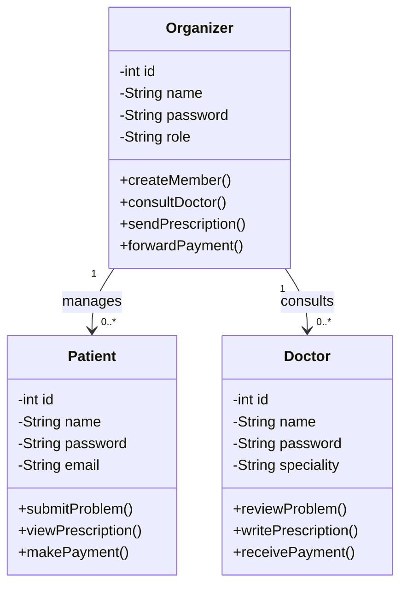

# Task 1: Basic Class Diagram

## Explanation

The Patient and the Doctor are never linked directly. The Organizer sits between
them: the Patient sends the problem to the Organizer, the Organizer asks a
Doctor, and the answer comes back the same way. The payment follows the same
path.

Multiplicity: one Organizer manages many Patients (0..*) and works with many
Doctors (0..*). Each Patient and each Doctor deals with one Organizer.

The Organizer also acts as administrator, which is why it has createMember():
it issues member IDs and passwords.
